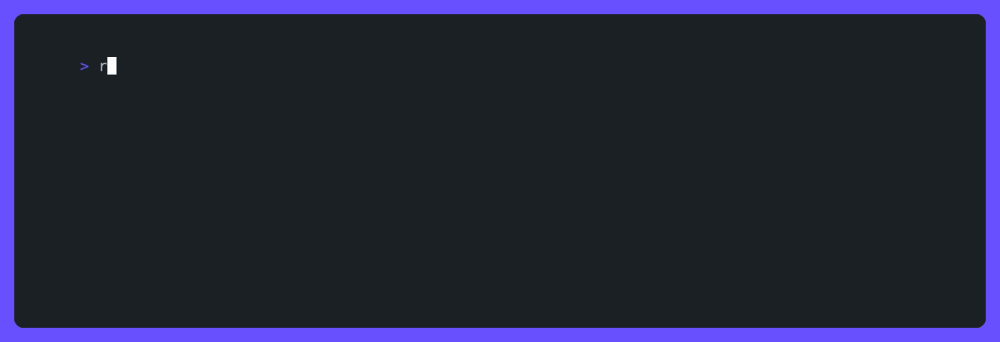
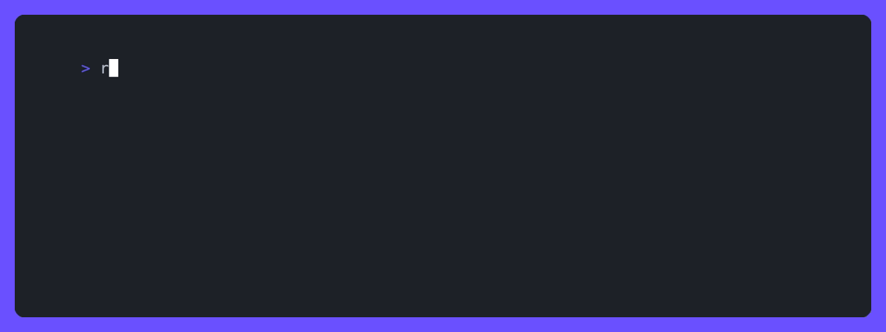
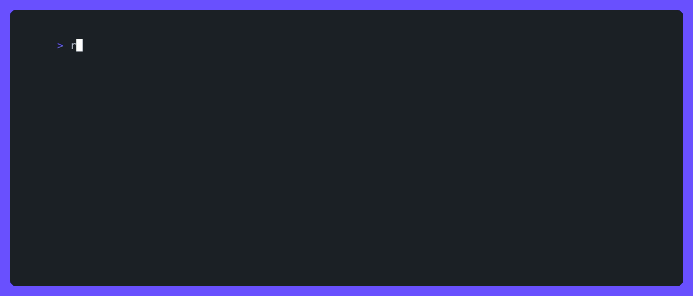
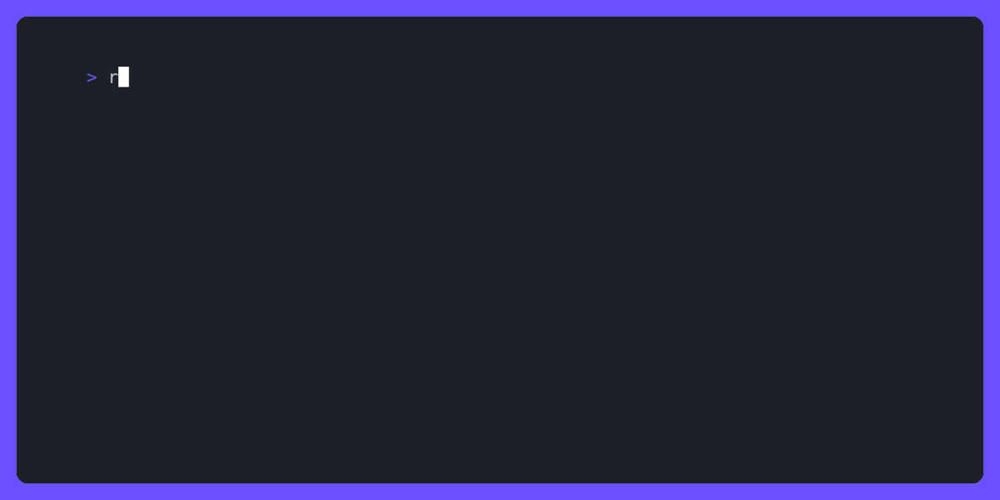

# 📦 Refit - Dependency Manager

<!-- [](https://www.npmjs.com/package/refit) -->
<!-- [](https://www.npmjs.com/package/refit) -->
<!--  -->

A CLI tool for reviewing, adding, updating, and viewing the changelog for dependencies in your Node.js project.



## Features

**🚀 Monorepo Support**: Manage all the dependencies in your monorepo with ease.

**🛠️ Package Managers**: Works with `npm`, `yarn`, and `pnpm`.

**🔥 Interactive**: Interactively bulk update dependencies or manage them individually in detail.

**🧙 Wizard:** Provides a step by step interactive wizard for full control over managing your dependencies in your project and monorepo workspaces.

**📜 Changelogs**: View changelogs for dependencies, even during interactive mode, so you never have to leave your terminal making dependency updates more efficient.

<!-- ## Installation

```bash
npm install -g refit
```

Or run with npx:

```bash
npx refit
```

> [!NOTE]  
> Requires Node.js 18+ -->

## List

List the project dependencies. By default, only dependencies that need to be updated are shown and are grouped by semver update type.


```bash
refit [options]

# or
refit ls [options]

# Examples:
# Display all dependencies in the project
refit --all

# Display all dependencies in the project grouped by package
refit --all --groupByPackage

# Only display dependencies with patch updates
refit --semver patch

# Only display dependencies in a specific workspace
refit --workspace workspace-name
```

| Option                    | Type [choices]                    | Default | Description                                     |
| ------------------------- | --------------------------------- | ------- | ----------------------------------------------- |
| `--all` , `-a`            | boolean                           | false   | show all dependencies including up to date ones |
| `--deprecated`            | boolean                           | false   | allow updating to deprecated versions           |
| `--depTypes` , `-d`       | array [`dev`, `prod`, `optional`] |         | filter by dependency type                       |
| `--global` , `-g`         | boolean                           | false   | check global node modules instead of local ones |
| `--groupByPackage` , `-G` | boolean                           | false   | list dependencies grouped by package            |
| `--noIssues` , `-n`       | boolean                           | false   | hide issues section from list output            |
| `--prerelease`            | boolean                           | false   | allow updating to prerelease versions           |
| `--sort`                  | string [`name`, `date`, `type`]   | type    | sort dependencies                               |
| `--updateTo` , `-to`      | string [`latest`, `wanted`]       | latest  | update dependencies to semver type              |
| `--semver` , `-s`         | array [`major`, `minor`, `patch`] |         | filter by update type                           |
| `--verbose` , `-v`        | boolean                           | false   | display all columns of dependency information   |
| `--workspace` , `-w`      | array                             |         | filter dependencies by workspace                |

### Warnings and Errors

The list command will also display warnings and errors found with your dependencies. This can be turned off with the `noIssues` option.

**⚠️ Warnings:**

-   Dependencies that have multiple versions installed across workspaces

**❌ Errors:**

-   Dependencies that are deprecated
-   Dependencies that are not on the registry
-   Dependencies that require an install
    -   a dependency could require install because the `node_modules` directory is missing
    -   changes were pulled down from the remote that include dependency updates and `npm install` hasn't been ran yet to sync up the local node modules

## Update

Updates outdated dependencies. This command only modifies the `package.json` file and does not run `npm install` or any other install command. By default, it will update all outdated dependencies to the latest version.



```bash
refit update [...dependencies] [options]

# or
refit up [...dependencies] [options]

# Examples:
# Update dependencies that only have patch updates
refit up --semver patch

# Update dev dependencies only
refit up --depTypes dev

# Update a single package
refit up package-name
```

| Option                 | Type [choices]                    | Default | Description                            |
| ---------------------- | --------------------------------- | ------- | -------------------------------------- |
| `--deprecated`         | boolean                           | false   | allow updating to deprecated versions  |
| `--depTypes` , `-d`    | array [`dev`, `prod`, `optional`] |         | filter by dependency type              |
| `--interactive` , `-i` | boolean                           | false   | interactively bulk update dependencies |
| `--prerelease`         | boolean                           | false   | allow updating to prerelease versions  |
| `--updateTo` , `-to`   | string [`latest`, `wanted`]       | latest  | update dependencies to semver type     |
| `--semver` , `-s`      | array [`major`, `minor`, `patch`] |         | filter by update type                  |
| `--workspace` , `-w`   | array                             |         | filter dependencies by workspace       |

### Interactive Mode

Interactive mode allows you to select multiple dependencies to update at once across all workspaces. It also provides the ability to view the changelog for each dependency before updating by pressing the `tab` key.



```bash
refit up -i
```

## Wizard

A step by step wizard to add or update dependencies. Provides the ability to view the changelog for each dependency before updating by pressing the `tab` key on the dependency select step. This command is useful for granular control over monorepo workspace dependencies.



```bash
refit wizard [options]

# or
refit w [options]
```

| Option               | Type [choices]                    | Default | Description                           |
| -------------------- | --------------------------------- | ------- | ------------------------------------- |
| `--deprecated`       | boolean                           | false   | allow updating to deprecated versions |
| `--depTypes` , `-d`  | array [`dev`, `prod`, `optional`] |         | filter by dependency type             |
| `--prerelease`       | boolean                           | false   | allow updating to prerelease versions |
| `--workspace` , `-w` | array                             |         | filter dependencies by workspace      |

## Changelogs

View the changelog for a dependency. By default, the changelog will only display the versions newer than the current version of the dependency. Use the `full` option to display the full changelog.


```bash
refit changes [dependency[@version]] [options]

# Examples:
# View the changelog for a dependency
refit changes package-name

# View the full changelog for a dependency
refit changes package-name --full

# View the changelog for a dependency from a specific version
refit changes package-name@1.0.0
```

| Option          | Type [choices] | Default | Description         |
| --------------- | -------------- | ------- | ------------------- |
| `--full` , `-f` | boolean        | false   | show full changelog |

### Sources

The changes for each version is available from 2 sources:

-   GitHub Releases
-   `CHANGELOG.md` file in the package

If both are available, the `s` key switches between the two sources.

## Global Options

These options can be used with any command:

| Option             | Type [choices]                 | Default | Description                            |
| ------------------ | ------------------------------ | ------- | -------------------------------------- |
| `--packageManager` | string [`npm`, `yarn`, `pnpm`] | npm     | package manager to use                 |
| `--workspaces`     | array                          |         | directories of the monorepo workspaces |

## Configuration File

Refit supports a configuration file in the root of your project called `.refitrc.json`. This file can be used to set default options for the CLI tool. All command options and global options can be set in the configuration file.

Example `.refitrc.json`:

```json
{
	"workspaces": ["packages/*"],
	"packageManager": "npm",
	"depTypes": ["prod", "dev"],
	"semver": ["major", "minor", "patch"],
	"deprecated": false
}
```
